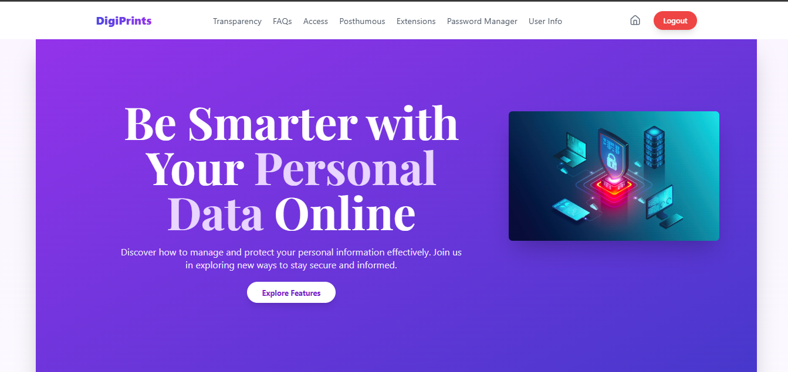
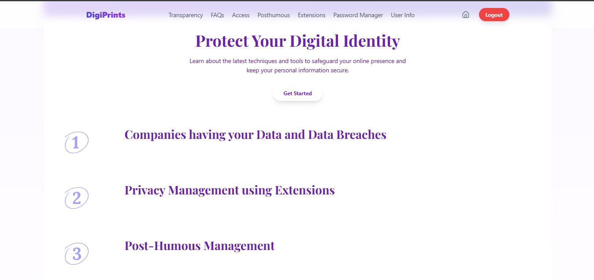
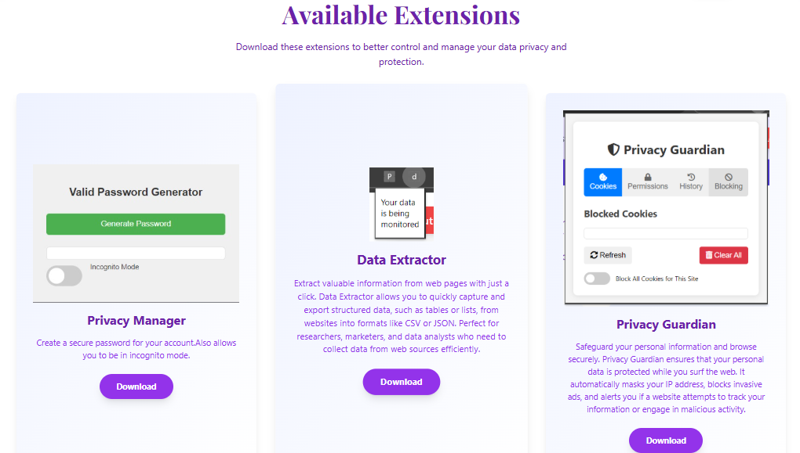
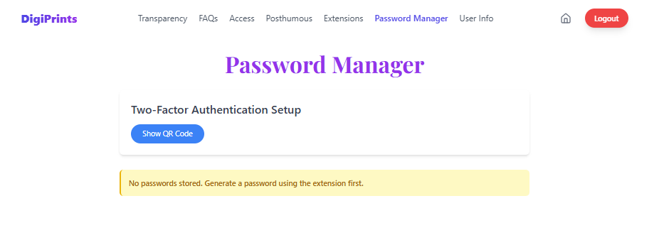

# DigiPrints 🔐
### *Take Control of Your Digital Footprint*

---

## Introduction

DigiPrints is a comprehensive full-stack application designed to help users track, understand, and secure their digital footprints across the internet. In an era where digital privacy is paramount, DigiPrints empowers users with the tools and insights needed to take control of their online presence, monitor their digital activities, and protect themselves from potential security threats.

---

## ✨ Features

### Core Application Features

- **🏠 Homepage Dashboard**
  - Centralized entry point showcasing all DigiPrints features
  - Clean, intuitive interface for easy navigation
  - Quick access to all core functionalities

- **📊 Data Activity Log**
  - Real-time tracking of recent online activities
  - Comprehensive monitoring of recently downloaded data
  - Detailed insights into recently visited links and browsing patterns

- **🛡️ Data Breach Checker**
  - Integration with external APIs for comprehensive security monitoring
  - Check if Gmail addresses have been involved in known data breaches
  - Instant alerts and detailed breach information across various companies and services

### Browser Extensions Suite

- **📧 Gmail History Reporter (Extension 1)**
  - Analyzes Gmail history with user permission
  - Generates comprehensive reports based on email data patterns
  - Provides insights into communication trends and potential security concerns

- **🚫 Privacy Blocker (Extension 2)**
  - Advanced blocking of online tracking mechanisms
  - Cookie management and suspicious link detection
  - Blocks unsolicited permission requests (camera, microphone, location)
  - Real-time protection against privacy invasions

- **🔑 Secure Password Generator (Extension 3)**
  - Generates highly secure, unique passwords with advanced algorithms
  - **Unique Security Feature**: Generated passwords can only be decoded using Google QR scanner
  - Enhanced protection against unauthorized access and password theft

---

## 📸 Screenshots
###Home

###Features

###Social Media Scan

###Available Extensions

#Password Generator



## ⚙️ Installation

### Prerequisites
- Node.js (v14 or higher)
- MongoDB or PostgreSQL database
- Modern web browser for testing extensions

### Backend Setup
```bash
# Clone the repository
git clone https://github.com/Rounak4456/Codeissance_Tech-Monarch.git
cd digiprints

# Install backend dependencies
cd backend
npm install

# Set up environment variables
cp .env.example .env
# Edit .env with your database credentials and API keys
```

### Frontend Setup
```bash
# Install frontend dependencies
cd ../frontend
npm install

# Configure environment variables
cp .env.example .env
# Edit .env with your backend API endpoint
```

## 🚀 Usage

### Starting the Application
```bash
# Start the backend server
cd backend
npm start

# Start the frontend development server
cd ../frontend
npm start
```

### Installing Browser Extensions
1. Open your browser's extension management page
2. Enable "Developer mode"
3. Click "Load unpacked" and select the built extension folders
4. Grant necessary permissions when prompted

### Using Core Features

**Homepage Dashboard:**
- Access all DigiPrints features from the main navigation
- View quick statistics and recent activity summaries

**Data Activity Log:**
- Monitor real-time tracking of your online activities
- Review downloaded files and visited links
- Export activity reports for further analysis

**Data Breach Checker:**
- Enter your Gmail address in the search field
- Review detailed breach reports and recommendations
- Set up monitoring alerts for future breaches

**Browser Extensions:**
- **Gmail Reporter**: Click the extension icon while on Gmail to generate reports
- **Privacy Blocker**: Runs automatically in the background, check popup for blocked items
- **Password Generator**: Use the extension popup to generate secure passwords, scan QR codes to reveal them

---

## 🧠 How It Works (Detailed Explanation)

### Overall Architecture
DigiPrints follows a modern full-stack architecture consisting of:
- **Frontend**: Single-page application providing user interface
- **Backend**: RESTful API server handling business logic and data management
- **Database**: Persistent storage for user data and activity logs
- **Browser Extensions**: Client-side scripts for real-time privacy protection and data collection

### Core Components Functionality

**Gmail History Reporter Extension:**
- Requests user permission to access Gmail data through Google APIs
- Parses email metadata and content patterns (with privacy safeguards)
- Generates comprehensive reports including sender analysis, frequency patterns, and potential security concerns
- Data is processed locally and optionally synced with the main application

**Privacy Blocker Extension:**
- Intercepts network requests using browser WebRequest APIs
- Analyzes URLs against known tracking domains and suspicious patterns
- Blocks cookies from third-party trackers using declarative net request APIs
- Prevents unauthorized access requests through permission API interception
- Real-time DOM manipulation to remove tracking scripts

**Secure Password Generator Extension:**
- Utilizes cryptographically secure random number generation
- Implements advanced password complexity algorithms
- **Unique QR Code Security**: Generated passwords are encoded into QR codes that can only be decoded by Google's QR scanner, adding an additional security layer against screenshots or clipboard attacks
- Passwords are never stored in plain text, even temporarily

**Data Activity Tracking:**
- Browser extension monitors download events and page navigation
- Securely transmits activity data to backend via encrypted API calls
- Backend processes and stores activity logs with timestamp and metadata
- Frontend displays real-time activity feeds with filtering and search capabilities

**Data Breach Checker Integration:**
- Integrates with external breach monitoring APIs (such as HaveIBeenPwned)
- Hashes email addresses before API queries for privacy protection
- Processes API responses to provide user-friendly breach information
- Implements caching to reduce API calls and improve performance

### Frontend-Backend-Extension Interactions
- Extensions communicate with the main application through secure message passing
- Backend provides centralized API endpoints for all data operations
- Real-time updates are handled through WebSocket connections
- All sensitive data transmission is encrypted and authenticated

---

## 💻 Technologies Used

### Frontend
- **Framework**: React.js with hooks for state management
- **Styling**: CSS3, Styled Components, or Material-UI
- **Routing**: React Router for single-page application navigation
- **HTTP Client**: Axios for API communication

### Backend
- **Runtime**: Node.js with Express.js framework
- **Database**: MongoDB with Mongoose ODM or PostgreSQL with Sequelize ORM
- **Authentication**: JWT (JSON Web Tokens) for secure user sessions
- **API Integration**: Axios or Fetch for external API calls
- **Security**: bcrypt for password hashing, helmet for security headers

### Browser Extensions
- **APIs**: Chrome Extension APIs (WebRequest, Storage, Permissions)
- **Build Tools**: Webpack for extension bundling
- **Languages**: JavaScript ES6+, HTML5, CSS3
- **Security**: Content Security Policy implementation

### Database & Infrastructure
- **Database**: MongoDB or PostgreSQL for data persistence
- **Caching**: Redis for session management and API response caching
- **Environment**: Docker for containerization (optional)
- **Deployment**: Cloud platforms (AWS, Heroku, or DigitalOcean)

### Development Tools
- **Version Control**: Git with GitHub for source code management
- **Package Management**: npm or yarn for dependency management
- **Testing**: Jest for unit testing, Cypress for end-to-end testing
- **Code Quality**: ESLint and Prettier for code formatting and linting

---

**DigiPrints** - Empowering users to take control of their digital privacy and security, one footprint at a time.

For questions, suggestions, or support, please open an issue or contact the development team.

---

*Made with ❤️ for digital privacy and security*
